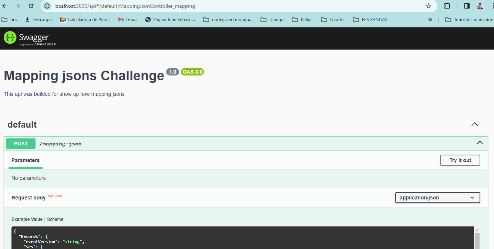
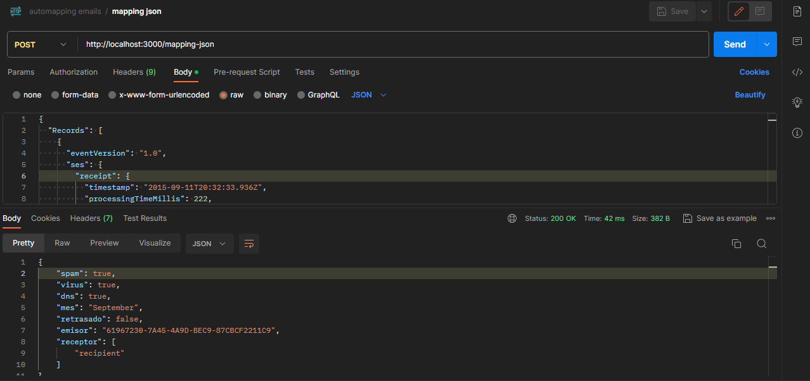
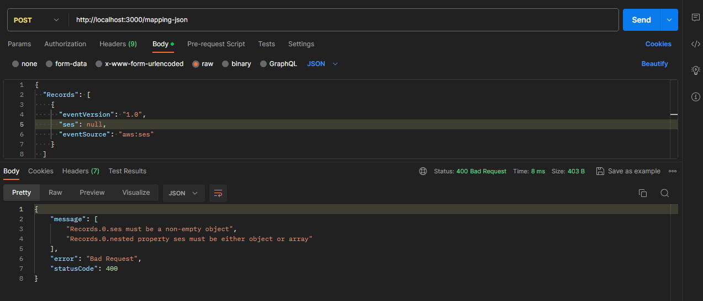

# Api mail-parser
# Introduction 
TODO: API that allows to map a json.

# Getting Started
TODO: Guide users through getting your code up and running on their own system. In this section you can talk about:
1.  Intall node and nest js
3.  Intall package, npm install or npm i
2.  Run with docker, npm run start

# Challenge
The easy one:
1. Create a NEST.js project.
2. Convert this JSON into a class.
3. Use mapper library to map the above JSON to this structure.
4. Create a controller with an endpoint that receives the first JSON and returns the second JSON as a response.

The real challenge:
1. Create a NEST.js project.
2. Use mail-parser to parse the content of an email with attachments. A JSON file should be attached.
3. Create a controller with an endpoint that receives the URL or path of an email file as a parameter.
4. The response should be the JSON attached in the email in any of the following cases: as a file attachment, inside the body of the email as a link, or inside the body of the email as a link that leads to a webpage where there is a link that leads to the actual JSON.

# how does it work The easy one: ?
1.  Step 1: Check out the documentation in swagger about the endpoints:

2.  Step 2: Build a request and make a request 

3.  Step 3: Modifiy the request with errors

3.  Step 3: Modifiy the request: s.Records[0].ses.receipt.virusVerdict.status == NOPASS

# TODO: Tools implemented:
1. Nest v10
1.1.    Swagger
1.2.    Express
1.3.    Class validator
2. It was implemented the solid principles

